# KS0361 KS0365 Micro:bit 37 sensors starter  Kit

**IMPORTANT NOTE:**

The 37 sensors starter kit (SKU KS0361) Not Includes micro:bit v2 v1.5 board.
The 37 sensors starter kit (SKU KS0365) Includes a micro:bit v2 board.

## 1.Introduction

**(1) What is Micro:bit?**

Designed by BBC, micro:bit main board aims to help children aged above 10 years
old to have a better learning of programming.

It is equipped with loads of components, including a 5*5 LED dot matrix, 2
programmable buttons, a compass, and a BT module.

This new version, that’s the micro:bit 2.0 board, has a touch-sensitive logo and
a MEMS microphone. And there is a built-in buzzer which can play sounds. The
golden fingers and gears added provide a better fixing of crocodile clips.
Moreover, this board has a sleeping mode to lower the power consumption of
battery and it can be entered if users long press the Reset & Power button on
the back of it. More importantly, the CPU capacity of this version is much
better than that of the V1.5 and the V2 has more RMA.

In final analysis, the V2 Micro:bit main board can allow customers to explore
more functions so as to make more innovative products.

Serving as a better device for learning some basic knowledge about
microcontroller and electronics, this sensor kit is designed by Keyestudio to
help programming enthusiasts enter this wonderful world. In application, we can
plug a shield in with DC7-9V to power not only the Micro bit board but also the
sensors/ modules. And the shield can be connected by jumper cap to control the
voltage of ports V1 and V2 used to supply power for sensors. We plan to provide
instructions for using this board and sensors/ modules, including offering
connection diagrams and test code.

1.  **Comparison between V2.0 & V1.5**

**Micro:bit main board V2.0**

**Micro:bit main board V1.5**

**More details:**

For Micro: Bit main board V2, pressing the Reset & Power button , it will reset
the Micro: Bit and rerun the program. If you hold it tight, the red LED will
slowly get darker.When the power indicator flickers into darkness, releasing the
button and your Micro: Bit board will enter sleep mode for power saving .This
will make the battery more durable. And you could press this button again to
“wake up” your Micro:bit.

For more information,please resort to following links：

<https://tech.microbit.org/hardware/>

https://microbit.org/new-microbit/

https://www.microbit.org/get-started/user-guide/overview/

<https://microbit.org/get-started/user-guide/features-in-depth/>

**(3) Pinout**

Micro:bit main board V2.0 VS V1.5

Browse the official website for more details:

<https://tech.microbit.org/hardware/edgeconnector/>

<https://microbit.org/guide/hardware/pins/>

**(4) Notes for the application of Micro:bit main board V2.0**

1.  It is recommended to cover it with a silicone protector to prevent short
    circuit for it has a lot of sophisticated electronic components.

2.  Its IO port is very weak in driving since it can merely handle current less
    than 300mA. Therefore, do not connect it with devices operating in large
    current,such as servo MG995 and DC motor or it will get burnt. Furthermore,
    you must figure out the current requirements of the devices before you use
    them and it is generally recommended to use the board together with a
    Micro:bit shield.

3.  It is recommended to power the main board via the USB interface or via the
    battery of 3V. The IO port of this board is 3V, so it does not support
    sensors of 5V. If you need to connect sensors of 5 V, a Micro: bit expansion
    board is required.

d.When using pins(P3、P4、P6、P7、P10)shared with the LED dot matrix, blocking
them from the matrix or the LEDs may display randomly and data about sensors
maybe wrong.

e.The battery port of 3V cannot be connected with battery more than 3.3V or the
main board will be damaged.

f. Forbid to use it on metal products to avoid short circuit.

To put it simple, Micro:bit V2 main board is like a microcomputer which has made
programming at our fingertips and enhanced digital innovation. And about
programming environment, BBC provides a website: <https://microbit.org/code/,>
which has a graphical MakeCode program easy for use.

## 2.Kit List

| **No.** | **Components**                                | **Quantity** | **Picture**                                          |
|---------|-----------------------------------------------|--------------|------------------------------------------------------|
| 1       | Keyestudio Micro: bit Sensor Shield V2        | 1            |      |
| 2       | Keyestudio White LED Module                   | 1            |      |
| 3       | Keyestudio Red LED Module                     | 1            | 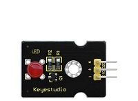     |
| 4       | Keyestudio 3W LED Module                      | 1            | 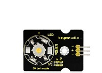     |
| 5       | Keyestudio RGB LED Module                     | 1            |      |
| 6       | Keyestudio Analog Temperature Sensor          | 1            | 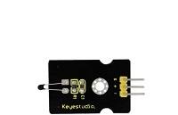     |
| 7       | Keyestudio Photocell Sensor                   | 1            | 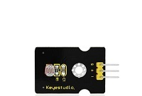     |
| 8       | Keyestudio Analog Sound Sensor                | 1            | **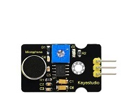** |
| 9       | Keyestudio Potentiometer Sensor               | 1            | 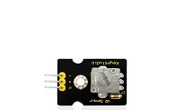     |
| 10      | Keyestudio Passive Buzzer Module              | 1            | 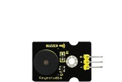     |
| 11      | Keyestudio Active Buzzer Module               | 1            | 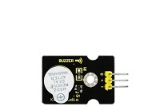     |
| 12      | Keyestudio Digital Push Button                | 1            |      |
| 13      | Keyestudio Digital Tilt Sensor                | 1            | 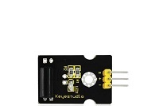     |
| 14      | Keyestudio Photo Interrupter Module           | 1            | **** |
| 15      | Keyestudio Capacitive Touch Sensor            | 1            |      |
| 16      | Keyestudio Traffic Light Module               | 1            | **** |
| 17      | Keyestudio Hall Magnetic Sensor               | 1            | **** |
| 18      | Keyestudio Line Tracking Sensor               | 1            |      |
| 19      | Keyestudio Infrared Obstacle Detector Sensor  | 1            | **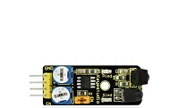** |
| 20      | Keyestudio PIR  Motion Sensor                 | 1            |      |
| 21      | Keyestudio Flame Sensor                       | 1            | 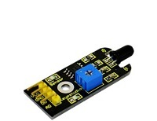     |
| 22      | Keyestudio Crash Sensor                       | 1            | **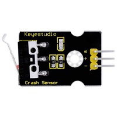** |
| 23      | Keyestudio Analog  Gas Sensor                 | 1            |      |
| 24      | Keyestudio Analog Alcohol Sensor              | 1            |      |
| 25      | Keyestudio Reed  Switch Module                | 1            |       |
| 26      | Keyestudio Water  Sensor                      | 1            | 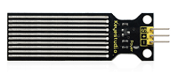      |
| 27      | Keyestudio Soil Humidity Sensor               | 1            |      |
| 28      | Keyestudio LM35 Linear Temperature Sensor     | 1            | 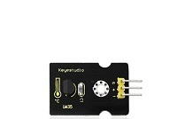     |
| 29      | Keyestudio Vibration Sensor                   | 1            |      |
| 30      | Keyestudio Thin-film Pressure Sensor          | 1            | 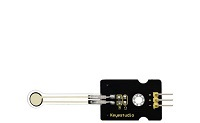     |
| 31      | Keyestudio GUVA-S12SD 3528 Ultraviolet Sensor | 1            | 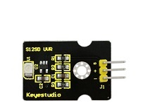     |
| 32      | Keyestudio 1602 I2C Module                    | 1            |      |
| 33      | Keyestudio TEMT6000 Ambient Light Sensor      | 1            | 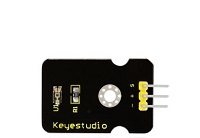     |
| 34      | HC-SR04 Ultrasonic Module                     | 1            |      |
| 35      | Keyestudio Joystick Module                    | 1            | 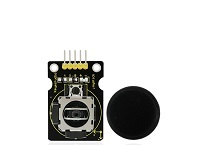     |
| 36      | Keyestudio Micro:bit  Servo                   | 1            |      |
| 37      | Keyestudio Single  Relay Module               | 1            | 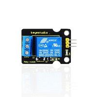     |
| 38      | Keyestudio Steam Sensor                       | 1            | 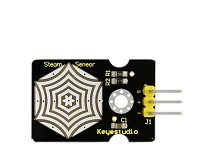     |
| 39      | 40pin F-F DuPont Jumper Wire                  | 1            |      |
| 40      | USB Cable                                     | 1            |      |
| 41      | 6 AA Battery Holder                           | 1            | 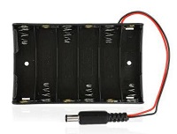     |

## 3.Install Micro:bit driver

If you have downloaded micro:bit driver, then no need to download it again.

If it is you first time to use micro:bit main board, then you will have to
download the driver.

First of all, connect the micro:bit to your computer using a USB cable.

And enter website
<https://www.dropbox.com/sh/w5mv8mvvufti0uj/AADTFPTV8NBN0IxQj_3TZ8ETa?dl=0> to
download the driver file of micro:bit
.

## 4.Instructions

The following instructions are applied for Windows system but can also serve as
a reference if you are using a different system.

**4.1 Write code and program**

This chapter describes how to write program with the Micro: bit main board V2
and load the program to the board.

You are recommended to browse the official website of Micro:bit for more
details, and the link is attached below:

[https://microbit.org/guide/quick/](Https://microbit.org/guide/quick/)

**Step 1:** connect the Micro: bit main board V2 with your computer

Firstly, link the Micro: bit main board V2 with your computer via the USB cable.
Macs, PCs, Chromebooks and Linux（including Raspberry Pi）systems are all
compatible with this board.

Note that if you are about to pair the board with your phone or tablet, please
refer to this link:

<https://microbit.org/get-started/user-guide/mobile/>

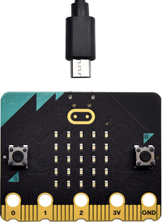

Secondly, the red LED on the back of the board is on, which means the board is
powered. Then Micro: bit main board V2 will appear on your computer as a driver
named “MICROBIT(E:)”. Please note that it is not an ordinary USB disk as shown
below.

**Step 2:** write programs

View the link https://makecode.microbit.org/ in your browser;

Click ‘New Project’;

The dialog box‘Create a Project’ appears, fill it with ‘heartbeat’ and
click‘Create √’to edit.

(If you are running Windows 10 system, it is also viable to edit on the APP
MakeCode for micro:bit , which is exactly like editing in the website. And the
link to the APP is
https://www.microsoft.com/zh-cn/p/makecode-for-micro-bit/9pjc7sv48lcx?ocid=badgep&rtc=1&activetab=pivot:overviewtab

Write a set of micro:bit code. You can drag some modules in the Blocks to the
editing area and then run your program in Simulator of MakeCode editor as shown
in the picture below, which demonstrates how to edit ‘heartbeat’ program .

As for loading test code , please turn to Chapter 4.5. And introduction of
MakeCode is on the next chapter 4.2.

**Step 3**: download test code

If your computer is Windows 10 and you have downloaded the APP MakeCode for
micro:bit to write program, what you will have to do to download the program to
your Micro: bit main board V2 is merely clicking the ‘Download’ button, then all
is done.

If you are writing program through the website, following these steps:

Click the ‘Download’ in the editor to download a "hex" file, which is a compact
program format that the Micro: bit main board can read. Once the hexadecimal
file is downloaded, copy it to your board V2 just like the process that you copy
the file to the USB driver. If you are running Windows system, you can also
right-click and select ‘Send to → MICROBIT (E:) ‘to copy the hex file to the
Micro: bit main board V2

You can also directly drag the "hex" file onto the MICROBIT (E:) disk.

During the process of copying the downloaded hex file to the Micro: bit main
board V2, the yellow signal light on the back side of the board flashes. When
the copy is completed, the yellow signal light will stop flashing and remain on.

**Step 4**: run the program

After the program is uploaded to the Micro: bit main board V2, you could still
power it via the USB cable or change to via an external power. The 5 x 5 LED dot
matrix on the board displays the heartbeat pattern.

|  |  |
|-------------------------------------------------|-------------------------------------------------|
| Power via USB cable                             | Power via external power (3V)                   |

**Step 5**：other programming languages

This chapter has described how to use the Micro: bit main board V2.

But except for the MakeCode graphical programming introduced you can also write
Micro: bit programs in other languages. Go to the link:
<https://microbit.org/code/> to know about other programming languages , or view
the link: <https://microbit.org/projects/>, to find something you want to have a
go.

**4.2 Makecode：**

Browse <https://makecode.microbit.org/> and enter MakeCode online editor or open
the APP MakeCode for micro:bit of Windows 10.

Click“New Project”, and input“heartbeat”，then enter MakeCode editor, as shown
below:

There are blocks“on start”and“forever”in the code editing area.

When the power is plugged or reset,“on start”means that the code in the block
only executes once, while“forever”implies that the code runs cyclically.

**4.3.Quick Download **

As mentioned before, if your computer is Windows 10 and you have downloaded the
APP MakeCode for micro:bit to write programs, the program written can be quickly
downloaded to the Micro: Bit main board V2 by selecting ‘Download’.

While it is a little trickier if you are using a browser to enter makecode.
However, if you use Google Chrome, suitable for Linux，macOS and Windows 10, the
process can be quicker too.

We use the webUSB function of Chrome to allow the internet page to access the
hardware device connected USB.

You could refer to the following steps to connect and pair devices.

**Device pairing:**

Connect micro:bit to your computer by USB cable;

Click“...”beside“Download”and click“Pair device”;

Then click another“Pair device”as shown below:

Then select“BBC micro:bit CMSIS-DPA” and click“Connect”. If “BBC micro:bit
CMSIS-DPA”does not show up for selection, please refer to
[https://makecode.microbit.org/device/usb/webusb/troubleshoot](https://makecode.microbit.org/device/usb/webusb/troubleshoot%20)

Update the firmware of the micro:bit V2:
[https://microbit.org/guide/firmware/](https://microbit.org/guide/firmware/%20)

If the links are too troublesome for you , then you can also turn to our
‘Troubleshooting Downloads with WebUSB’and“upload the firmware”in the folder we
provided.

Then click“Download”. The program is directly downloaded to Micro: Bit main
board V2 and the sentence“Download completed!” appears.

**4.4 Resources and test code **

We also provide a link <https://fs.keyestudio.com/KS0361-0365> containing the
information of the product from relevant tools to test codes, tutorials and
troubleshooting methods as well, as shown in the figure below:

**4.5 Input test code**

We provide hexadecimal code files (project files) for each project. The file
contains all the contents of the project and can be imported directly, or you
can manually drag the code blocks to complete the program for each project. For
simple projects, dragging a block of code to complete the program is
recommended. For complex projects, it is recommended to conduct the program by
importing the hexadecimal code file we provide.

Let's take the "Heatbeat" project as an example to show how to load the code.

Open the Web version of Makecode or the Windows 10 App version of Makecode.

Click“Import File”

Select“ ../Makecode Code/Project 1\_ Heart beat/Project 1\_ Heart beat.hex” ;

Then click “Go ahead”.

In addition to importing the test code file provided into the Makecode compiler
above, you can also drag the the test code file provided into the code editing
area of the Makecode compiler, as shown in the figure below:

After a few seconds, it is done.

Note: if your computer system is Windows7 or 8 instead of Windows 10, the
pairing cannot be done via Google Chrome. Therefore, digital signal or analog
signal of sensors and modules cannot be shown on the serial port simulator.
However, you need to read the corresponding digital signal or analog signal.So
what can we do? You can use the CoolTerm software to read the serial port data
of the microbit. Next chapter is about how to install CoolTerm.

 **4.6 CoolTerm Installation **

CoolTerm program is used to read the data on serial port.

Download CoolTerm program:

<https://freeware.the-meiers.org/>

1.  After the download, we need to install CoolTerm program file, below is
    Windows system taken as an example.

2.  Choose“win”to download the zip file of CoolTerm

3.  Unzip file and open it. (also suitable for Mac and Linux system)

(4)Double-click .

The functions of each button on the Toolbar are listed below:
<http://wiki.keyestudio.com/index.php/File:IDE.png>

|  | Open up a new Terminal                           |
|-------------------------------------------------|--------------------------------------------------|
|  | Open a saved Connection                          |
|  |  Save the current Connection to disk             |
|  | Open the Serial Connection                       |
|  | Close the Serial Connection                      |
|  | Clear the Received Data                          |
|  | Open the Connection Options Dialog               |
|  | Display the Terminal Data in Hexadecimal Format  |
|  | Display the Help Window                          |

## 5. Projects

### **Project 1: Heartbeat**

    **Project Introduction**

This project is easy to conduct with a micro:bit V2 main board, a Micro USB
cable and a computer. The micro:bit LED dot matrix will display a relatively big
heart-shaped pattern and then a smaller one. This alternative change of this
pattern is like heart beating. This experiment serves as a starter for your
entry to the programming world.

  **Components Needed:**

-   Micro:bit main board V2 \*1

-   USB cable\*1

    **Connection Diagram:**

Attach the Micro:bit main board V2 to your computer via the USB cable.

  **Test Code:**

No need to worry though you are not good at programming. You will get help.

Firstly, you can view this link
[https://makecode.micro:bit.org/reference](https://makecode.microbit.org/reference)
to find more information about micro: bit blocks. Then this link
[https://makecode.micro:bit.org/](https://makecode.microbit.org/) can help you
write code.

  **Test Results:**

After uploading test code to micro:bit main board V2 and keeping the connection
with the computer to power the main board, the LED dot matrix shows pattern
“”and then
“”alternatively.

( Please refer to chapter 4.3 to know how to download test code quickly.)

If the downloading is not smooth, please remove the micro USB from the main
board and then reconnect them and reopen Makecode to try again.

### **Project 2: Light A Single LED**

  **Project Introduction:**

In this project, we intend to control a certain LED of the micro:bit main board
V2 to shine.

  **Components Needed:**

-   Micro:bit main board V2 \*1

-   USB cable\*1

  **Connection Diagram:**

Attach the Micro:bit main board V2 to your computer via the USB cable.

**Introduction of components:**

The LED dot matrix consists of 25 LEDs arranged in a 5 by 5 square. In order to
locate these LEDs quickly, as the figure shown below, we can regarded this
matrix as a coordinate system and create two aces by marking those in rows from
0 to 4 from top to bottom, and the ones in columns from 0 to 4 from the left to
the right. Therefore, the LED sat in the second of the first line is (1,0）and
the LED positioned in the fifth of the fourth column is (3,4）and others
likewise.

  **Test Code:**

  **Test Results**

After uploading test code to micro:bit main board V2 and powering the main board
via the USB cable, the LED in (1,0) lights up for 1s and the one in (3,4) shines
for 1s and repeat this sequence.

### **Project 3: LED Dot Matrix**

  **Project Introduction:**

Dot matrices are very commonplace in daily life. They have found wide
applications in LED advertisement screens, elevator floor display, bus stop
announcement and so on.

The LED dot matrix of Micro: bit main board V2 contains 25 LEDs in a grid.
Previously, we have succeeded in controlling a certain LED to light by
integrating its position value into the test code. Supported by the same theory,
we can turn on many LEDs at the same time to showcase patterns, digits and
characters.

What’s more, we can also click”show icon“ to choose the pattern we like to
display. Last but not the least, we can design patterns by ourselves.

  **Components Needed:**

-   Micro:bit main board V2 \*1

-   USB cable\*1

 **Connection Diagram:**

Attach the Micro:bit main board V2 to your computer via the USB cable.

  **Test Code:**

****

 **Test Results:**

After uploading test code to micro:bit main board V2 and powering the main board
via the USB cable, we find that the 5\*5 dot matrix start to show numbers
1,2,3,4 and 5, and then it alternatively shows a downward arrow
, word “Hello”, a heart pattern
, and an arrow pointing at
northeast , then at southeast
, then at southwest
, and then at northwest
.

### **Project 4: Programmable Buttons**

** Project Introduction:**

Buttons can be used to control circuits. In an integrated circuit with a button,
the circuit is connected when pressing the button and it is open the other way
around.

 Micro: Bit main board V2 boasts three buttons, two are programmable buttons(marked with A and B), and the one on the other side is a reset button. By pressing the two programmable buttons three different signals can be input . We can press button A or B alone or press them together and the LED dot matrix shows A,B and AB respectively. Let’s get started.

** Components Needed:**

-   Micro:bit main board V2 \*1

-   USB cable\*1

** Connection Diagram:**

Attach the Micro:bit main board V2 to your computer via the USB cable.

 **Test Code 1:**

  **Test Results 1:**

After uploading test code to micro:bit main board V2 and powering the main board
via the USB cable, the 5\*5 LED dot matrix shows A if button A is pressed, B if
button B pressed, and AB if button A and B pressed together.

  **Test Code 2:**

  **Test Results 2:**

After uploading test code to micro:bit main board V2 and powering the main board
via the USB cable, when pressing the button A the LEDs turning red increase
while when pressing the button B the LEDs turning red reduce.

### **Project 5: Temperature Detection**

  **Project Introduction:**

In this project, we will make Micro: Bit main board V2 to detect temperature of
external environment with the range of 40℃\~105℃.

  **Components Needed:**

-   Micro:bit main board V2*1

-   USB cable*1

  **Connection Diagram:**

Attach the Micro:bit main board V2 to your computer via the Micro USB cable.

  **Test Code:**

  **Test Results:**

After uploading test code to micro:bit main board V2, powering the main board
via the USB cable, and clicking “Show console Device”, the data of temperature
shows in the serial monitor page as shown below:

If you're running Windows 7 or 8 instead of Windows 10, via Google Chrome won't
be able to match devices. You'll need to use the CoolTerm serial monitor
software to read data.

You could open CoolTerm software, click Options, select SerialPort, set COM port
and baud rate to 115200 (after testing, the baud rate of USB SerialPort
communication on Micro: Bit main board V2 is 115200), click OK, and Connect. The
CoolTerm serial monitor shows the change of temperature in the current
environment, as shown in the figures below :

### **Project 6: Geomagnetic Sensor**

** Project Introduction:**

This project aims to explain the use of the Micro: bit geomagnetic sensor, which
can not only detect the strength of the geomagnetic field, but also be used as a
compass to find bearings. It is also an important part of the Attitude and
Heading Reference System (AHRS). Micro: Bit main board V2 uses LSM303AGR
geomagnetic sensor, and the dynamic range of magnetic field is ±50 gauss. In the
board, the magnetometer module is used in both magnetic detection and compass.
In this experiment, the compass will be introduced first, and then the original
data of the magnetometer will be checked.The main component of a common compass
is a magnetic needle, which can be rotated by the geomagnetic field and point
toward the geomagnetic North Pole (which is near the geographic South Pole) to
determine direction.

** Components Needed:**

-   Micro:bit main board V2 \*1

-   USB cable\*1

 **Connection Diagram:**

Attach the Micro:bit main board V2 to your computer via the USB cable.

  **Test Code 1:**

  **Test Results:**

After uploading test code to micro:bit main board V2 and powering the board via
the USB cable, and pressing the button A, the board asks us to calibrate compass
and the LED dot matrix shows “TILT TO FILL SCREEN”. Then enter the calibration
page. Rotate the board until all 25 red LEDs are on as shown below:

After that, a smile pattern 
appears, which implies the calibration is done. When the calibration process is
completed, pressing the button A will make the magnetometer reading display
directly on the screen. And the direction north, east, south and west correspond
to 0°, 90°, 180° and 270°.

  **Test Code 2:**

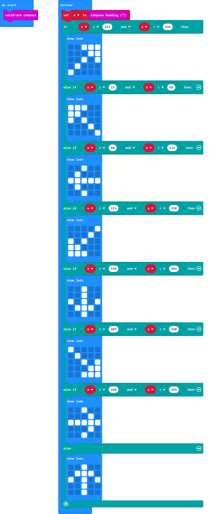

This module can keep reading data to determine direction, so does point to the
current magnetic North Pole by arrow.

As shown in the figure, if the reading is between 292.5 and 337.5, the LED dot
matrix displays an arrow pointing to the top right. Since 0.5 cannot be inputted
in the code,the values added in the code are 293 and 338.Then add other logical
criteria to form a compete test code as shown below:

 **Test Results 2:**

Upload the test code to micro:bit main board V2, power the board via the USB
cable, and finish the calibration process following the instructions.

Rotating the Micro: Bit main board V2, the LED dot matrix shows pattern about
bearings.

### **Project 7: Accelerometer**

  **Project Introduction:**

The Micro: Bit main board V2 has a built-in LSM303AGR gravity acceleration
sensor, also known as accelerometer, with a resolution of 8/10/12 bits. The code
section sets the range to 1g, 2g, 4g, and 8g.

We often use accelerometer to detect the status of machines.

In this project, we will introduce how to measure the position of the board with
the accelerometer. And then have a look at the original three-axis data output
by the accelerometer.

  **Components Needed:**

-   Micro:bit main board V2 \*1

-   USB cable\*1

  **Connection Diagram:**

Attach the Micro:bit main board V2 to your computer via the USB cable.

  **Test Code 1:**

 **Test Results 1:**

After uploading the test code to micro:bit main board V2 and powering the board
via the USB cable, if we shake the Micro: Bit main board V2, no matter at any
direction, the LED dot matrix displays the digit “1”.

When it is kept upright （put its logo above the LED dot matrix）as shown below,
the number 2 will show.

When it is kept upside down( make its logo below the LED dot matrix) , it will
show as below.

When it is placed still on the desk, showing its front side, the number 4
appears.

When it is placed still on the desk, showing its back side, the number 5 will
exhibit.

When the board is tilted to the left , the LED dot matrix shows the number 6 as
shown below.

When the board is tilted to the right , the LED dot matrix displays the number 7
as shown below

When the board is knocked to the floor, this process can be considered as a free
fall and the LED dot matrix shows the number 8. (Please note that this test is
not recommended for it may damage the main board.)

Attention: if you’d like to try this function, you can also set the acceleration
to 3g, 6g or 8g. But still ,we don not recommend.

  **Test Code 2:**

  **Test Results 2:**

Upload test code to micro:bit main board V2, power the main board via the USB
cable, and click“Show console Device”.

After referring to the MMA8653FC data manual and the hardware schematic diagram
of the Micro: Bit main board V2, the accelerometer coordinate of the board are
shown in the figure below:

The following interface shows the decomposition value of acceleration in X axis,
Y axis and Z axis respectively, as well as acceleration synthesis (acceleration
synthesis of gravity and other external forces).

If you're running Windows 7 or 8 instead of Windows 10, via Google Chrome won't
be able to match devices. You'll need to use the CoolTerm serial monitor
software to read data.

You could open CoolTerm software, click Options, select SerialPort, set COM port
and baud rate to 115200 (after testing, the baud rate of USB SerialPort
communication on Micro: Bit main board V2 is 115200), click OK, and Connect. The
CoolTerm serial monitor shows the data of X axis, Y axis and Z axis , as shown
in the figures below :

### **Project 8: Light Detection**

 **Project Introduction:**

In this project, we focus on the light detection function of the Micro: Bit main
board V2. It is achieved by the LED dot matrix. And it can be viewed as a
photosensor.

  **Components Needed:**

-   Micro:bit main board V2 \*1

-   USB cable\*1

 **Connection Diagram:**

Attach the Micro:bit main board V2 to your computer via the USB cable.

 **Test Code:**

  **Test Results:**

Upload the test code to micro:bit main board V2, power the board via the USB
cable and click “Show console Device”.

When the LED dot matrix is covered by hand, the value of light intensity showed
is approximately 0; when the LED dot matrix is exposed to light, the value
displayed gets bigger with the light intensity as shown below.

The 20 in the code is an arbitrary value of light intensity. If the current
light level is less than or equal to 20, the moon will appear on the LED dot
matrix. If it's bigger than 20, the sun will appear.

If you're running Windows 7 or 8 instead of Windows 10, via Google Chrome won't
be able to match devices. You'll need to use the CoolTerm serial monitor
software to read data.

You could open CoolTerm software, click Options, select SerialPort, set COM port
and baud rate to 115200 (after testing, the baud rate of USB SerialPort
communication on Micro: Bit main board V2 is 115200), click OK, and Connect. The
CoolTerm serial monitor shows the value of light intensity , as shown in the
figures below :

### **Project 9: Speaker**

  **Project Introduction:**

The Micro: Bit main board V2 has an built-in speaker, which makes adding sound
to the programs easier. We can program the speaker to air all kinds of tones,
such as playing the song "Ode to Joy" .

  **Components Needed:**

-   Micro:bit main board V2 \*1

-   USB cable\*1

  **Connection Diagram:**

Attach the Micro:bit main board V2 to your computer via the USB

cable.

  **Test Code 1:**

  **Test Results 1 :**

After uploading the test code to micro:bit main board V2 and powering the board
via the USB cable, the speaker utters sound and the LED dot matrix shows the
logo of music.

  **Test Code 2:**

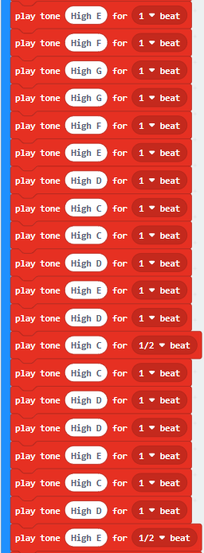

The musical score of the song "Ode to Joy" is as follows:

:

Link to more information about musical notation:
<https://en.wikipedia.org/wiki/Numbered_musical_notation>

  **Test Results 2:**

After uploading the test code to micro:bit main board V2 and powering the board
via the USB cable, the board airs the song "Ode to Joy".

### **Project 10: Touch-sensitive Logo**

** Project Introduction:**

The Micro: Bit main board V2 is equipped with a golden touch-sensitive logo,
which can act as an input component and function like an extra button.

It contains a capacitive touch sensor that senses small changes in the electric
field when pressed (or touched), just like your phone or tablet screen do. When
you press it , you can activate the program.

  **Components Needed:**

-   Micro:bit main board V2 \*1

-   USB cable\*1

  **Connection Diagram:**

Attach the Micro:bit main board V2 to your computer via the USB cable.

  **Test Code:**

  **Test Results:**

After uploading the test code to micro:bit main board V2 and powering the board
via the USB cable, the LED dot matrix exhibits the heart pattern when the
touch-sensitive logo is pressed or touched and displays digit when the logo is
released.

### **Project 11: Microphone**

  **Project Introduction:**

The Micro: Bit main board V2 is built with a microphone which can test the
volume of ambient environment. When you clap, the microphone LED indicator will
turn on. Since it can measure the intensity of sound, you can make a noise scale
or disco lighting changing with music. The microphone is placed on the opposite
side of the microphone LED indicator and in proximity with holes that lets sound
pass. When the board detects sound, the LED indicator lights up.

  **Components Needed:**

-   Micro:bit main board V2 \*1

-   USB cable\*1

  **Connection Diagram:**

Attach the Micro:bit main board
V2 to your computer via the USB cable.

  **Test Code 1:**

  **Test Results 1:**

After uploading test code to micro:bit main board V2 and powering the board via
the USB cable, the LED dot matrix displays pattern
“”when you claps and pattern
 when it is quiet around.

  **Test Code 2:**

  **Test Results 2:**

Upload test code to micro:bit main board V2, power the board via the USB cable
and click “Show console Device”as shown below.

When the sound is louder around, the sound value shows in the serial port gets
bigger as shown below.

What’s more, when pressing the button A, the LED dot matrix displays the value
of the biggest volume( please note that the biggest volume can be reset via the
Reset button on the other side of the board ) while when clapping, the LED dot
matrix shows the pattern of the sound.

### **Project 12: Bluetooth Data Reading**

** Project Introduction:**

The Micro: Bit main board V2 comes with a nRF52833 processor (with built-in
Bluetooth 5.1 BLE(Bluetooth Low Energy) device) and a 2.4GHz antenna for
Bluetooth wireless communication and 2.4GHz wireless communication. With the
help of them, the board is able to communicate with a variety of devices with
tool Bluetooth, including smart phones and tablets.

In this project, we mainly concentrate on the Bluetooth wireless communication
function of this main board. Linked with Bluetooth, it can transmit code or
signals. To this end, we should connect an Apple device (a phone or an iPad) to
the board.

Since setting up Android phones to achieve wireless transmission is similar to
that of Apple devices, no need to illustrate again.

  **Preparation**

\*Attachment of the Micro:bit main board V2 to your computer via the USB cable.

\*An Apple device (a smart phone or an iPad) or an Android device;

  **Procedures:**

For Apple devices, enter this link
<https://www.microbit.org/get-started/user-guide/ble-ios/> with your computer
first, and then click“Download pairing HEX file”to download the Micro: Bit
firmware to a folder or desk, and upload the downloaded firmware to the Micro:
Bit main board V2.

Search“micro bit”in your App Store to download the APP micro:bit.

Connect your Apple device with Micro: Bit main board V2:

Firstly, turn on the Bluetooth of your Apple device and open the APP micro:bit
to select item “Choose micro:bit”to start pairing Bluetooth.

Please make sure that the Micro: Bit main board V2 and your computer are still
linked via the USB cable.

Secondly, click “Pair a new micro:bit”;

Following the instructions to press button A and B at the same time(do not
release them until you are told to) and press Reset & Power button for a few
seconds.

Release the Reset & Power button, you will see a password pattern shows on the
LED dot matrix. Now , release buttons A and B and click “Next”.

Set the password pattern on your Apple device as the same pattern showed on the
matrix and click “Next”.

Still click “Next” and a dialog box props up as shown below. Then click "Pair".
A few seconds later, the match is done and the LED dot matrix displays the "√"
pattern.

After the match with Bluetooth, write and upload code with the App.

Click“Create Code”to enter the programming page and write code.

Click  and the box
 appears, and then select“Create
√”.

Name the code as“1”and click  to
save it.

Click the third item“Flash”to enter the uploading page. The default code program
for uploading is the one saved just now and named "1" and then click the other
"Flash" to upload the code program "1".

If the code is uploaded successfully a few seconds later, the App will emerge as
below and the LED dot matrix of the Micro: Bit main board V2 will exhibit a
heart pattern.

### **Project 13: LED Blinks**

 Project Introduction:

The LED blink is one of the most basic experiments. In the above example use of
micro:bit, we have mentioned the 25 LED display of micro:bit. In this project,
you will learn how to control an LED blink using a keyestudio digital white LED
module and a micro:bit sensor shield. Before testing, you should first turn off
the 5\*5 LED function of micro:bit.

  **Components Needed:**

-   Micro:bit main board\*1

-   Keyestudio Micro:bit sensor V2 shield\*1

-   USB Cable\*1

-   keyestudio Digital White LED Module\*1

-   DuPont jumper wire\*3

  **Connection Diagram:**

    ****

  **Test Code:**

    

  **Test Results:**

Hook up the components, plug in power and download code to the micro:bit you
will see an LED blink on the module, with an interval about one second.

### **Project 14: LED Breathes**

** Project Introduction:**

The light breath experiment is a little bit similar to the previous project.
This time we connect the keyestudio LED module to the sensor shield. Connect the
Signal pin of LED module to P0 of micro:bit. From the Pinout diagram of
micro:bit, you can get the P0 can be used as Analog IN.

This lesson you will learn how to control the brightness of LED on the module,
gradually becoming brighter and dimming, just like the LED is breathing.

  **Components Needed:**

-   Micro:bit main board\*1

-   Keyestudio Micro bit Sensor V2 Shield\*1

-   USB Cable\*1

-   keyestudio White LED Module\*1

-   DuPont jumper wires

  **Connection Diagram**

    ****

  **Test Code**

    

  **Test Results**

Hook up the components, plug in power and download code to the micro:bit you
should finally see an LED on the module gradually become brighter, then
gradually dim, circularly just like the LED is breathing.

### **Project 15: LED Blinks and Breathes**

  **Project Introduction:**

In this project, we combine the project 13 and project 14. You will learn how to
control the LED on the module blink for two times, then breath for two times,
circularly. This time we use keyestudio 3W LED module, which has high brightness
and can be used as illumination.

  **Components Needed:**

-   Micro:bit main board\*1

-   Keyestudio Micro bit Sensor V2 Shield\*1

-   USB Cable\*1

-   keyestudio 3W LED Module\*1

-   DuPont jumper wires

  **Connection Diagram**

****

  **Test Code**

    

  **Test Results**

Hook up the components, plug in power and download code to the micro:bit you
should see the LED on the module firstly blink two times, then breath two times,
circularly.

### **Project 16: Make A Sound**

** Project Introduction:**

We can use Micro:bit to make many interactive works of which the most commonly
used is acoustic-optic display. All the previous projects have something to do
with LED. However, the circuit in this experiment can produce sound. Normally,
the experiment is done with a buzzer or a speaker because buzzer is more simpler
and easier to use.

There are two kinds of buzzer, active buzzer and passive buzzer. In this lesson,
we will use Micro:bit to drive an active buzzer. The active buzzer inside has a
simple oscillator circuit which can convert constant direct current into a
certain frequency pulse signal. Once active buzzer receives a high level, it
will produce an audible beep.

  **Components Needed:**

-   Micro:bit main board\*1

-   Keyestudio Micro bit Sensor V2 Shield\*1

-   USB Cable\*1

-   keyestudio Active Buzzer\*1

-   DuPont jumper wires

  **Connection Diagram**

    ****

  **Test Code**

    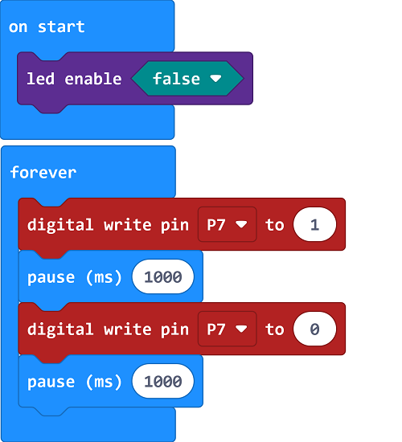

** Test Results**

Hook up the components, plug in power and download code to the micro:bit you
should hear the buzzer module sound and then stop, circularly. It seems like the
sound is interrupted.

### **Project 17: Play Music**

** Project Introduction:**

In this project, you will learn how to play music with keyestudio passive buzzer
module. We are going to complete two experiments.

One is to directly control the High and Low level input of micro:bit P0 end, set
two square waves to control the buzzer sound. The other is to use the software's
own function, input the square waves of different frequencies and different
lengths on the P0 end. Finally make the buzzer module play the song "Ode to
Joy".

(The input PIO port can only be P0, can not be other interfaces).

  **Components Needed:**

-   Micro:bit main board\*1

-   Keyestudio Micro bit Sensor V2 Shield\*1

-   USB Cable\*1

-   Keyestudio Passive Buzzer Module\*1

-   DuPont jumper wire

  **Connection Diagram**

    ****

  **Test Code 1**

  **Code 2**

**Note:** on the MakeCode Block webpage, click the icon
, you can see the frequency of
each tone as follows.

  **Test Results**

Done wiring and powered up, send the code 1 to micro:bit, you should hear two
sounds produced from passive buzzer circularly. If send the code 2 to micro:bit,
the buzzer will play the song Ode To Joy! Really amazing. Right? You can try to
change the tone to play other music.

### **Project 18: Change Colors**

** Project Introduction:**

In this project, we will use a keyestudio RGB LED module. This Common Anode RGB
LED module is a fun and easy way to add some color to your projects. In our
program, we will connect the RGB module to micro:bit, then control the P0, P1,
P2 Analog Input of micro:bit main board. You will learn how to control the RGB
LED on the module firstly show three colors (Red, Green and Blue), then quickly
change the color state.

  **Components Needed:**

-   Micro:bit main board\*1

-   Keyestudio Micro bit Sensor V2 Shield\*1

-   USB Cable\*1

-   keyestudio RGB LED Module\*1

-   DuPont jumper wire\*4

  **Connection Diagram**

    ****

  **Test Code**

1.  **Test Results**

Hook up the components, plug in power and download code to the micro:bit you
should see the RGB module firstly show three colors, separately red, green and
blue light. Then change the color quickly and circularly.

### **Project 19: Button Control**

** Project Introduction:**

When design the circuit, button switch is a commonly used component. The
micro:bit main board has two built-in buttons, however, sometimes still need to
use external button when design the circuit. So in this project, you will learn
how to use our push button module to control 5\*5 LED of micro:bit display
different images.

  **Components Needed:**

-   Micro:bit main board\*1

-   Keyestudio Micro bit Sensor V2 Shield\*1

-   USB Cable\*1

-   Keyestudio Digital Push Button\*1

-   DuPont jumper wires

  **Connection Diagram**

****

  **Test Code**

    

  **Test Results**

Wire up components, upload code, plug in power and press digital button module.

Then the micro:bit will show. If
the digital button module is not touched, image
 will be displayed.

### **Project 20: Tilt Control**

** Project Introduction:**

When design the circuit, sometimes you will need to test whether an object is
tilted left or right, so in this case you can use our tilt sensor. In this
project, you will learn how to use our digital tilt sensor to control 5\*5 LED
of micro:bit display different images.

  **Components Needed:**

-   Micro:bit main board\*1

-   Keyestudio Micro bit Sensor V2 Shield\*1

-   USB Cable\*1

-   keyestudio Digital Tilt Sensor\*1

-   DuPont jumper wires

  **Connection Diagram**

****

  **Test Code**

  **Test Results**

Done wiring and powered up, send the code to micro:bit. When the sensor is
tilted to the left, the LED matrix will show
; however, if the sensor is
tilted to the right, image will
be displayed.

### **Project 21: Light Interrupter**

  **Project Introduction:**

In daily life, we often need to implement the function of counting and speed
measurement. How to achieve these functions? You can easily match
photo-interrupter module with microcontroller via code debugging. In this
lesson, we connect a keyestudio photo-interrupter module to micro:bit sensor
shield, then control 5\*5 LED of micro:bit show different images.

  **Components Needed:**

-   Miro:bit main board\*1

-   Keyestudio Micro bit Sensor V2 Shield\*1

-   USB Cable\*1

-   Keyestudio Photo Interrupter Module\*1

-   DuPont jumper wires

  **Connection Diagram**

****

  **Test Code**

    

  **Test Results**

Wire up the components, upload code and plug in power. When you cover the notch
of sensor with a piece of paper, the image
will be shown ; on the contrary,
the image will be displayed.

### **Project 22: Capacitive Touch**

  **Project Introduction:**

In the above project 8, we have done a button control experiment. This time, we
are going to replace the button switch with a capacitive touch sensor. In this
project, you will learn how to use Keyestudio touch sensor to control 5\*5 LED
of micro:bit show different images.

** Components Needed:**

-   Micro:bit main board\*1

-   Keyestudio Micro bit Sensor V2 Shield\*1

-   USB Cable\*1

-   Keyestudio Capacitive Touch Sensor\*1

-   DuPont jumper wires

** Connection Diagram**

****

** Test Code**

** Test Results**

Wire up the components, upload code and plug in power. If you touch the
sensitive area, the micro:bit will
display; otherwise,
image will be shown.

### **Project 23: Traffic Light**

**Project Introduction:**

When walking at the crossroad, you can see the traffic light command the orderly
movement of pedestrians and vehicles. So how is the traffic light controlled to
operate? In this project, we will connect a traffic light module to our sensor
shield, controlling traffic light blink with micro:bit. You will learn how to
simulate the running of traffic light.

** Components Needed:**

-   Micro:bit main board \*1

-   Keyestudio Micro bit Sensor V2 Shield \*1

-   USB Cable \*1

-   Keyestudio Traffic Light Module \*1

-   DuPont jumper wires

** Connection Diagram**

****

** Test Code**

** Test Results**

Done wiring and powered up, send the code to micro:bit, eventually you should
see the green LED lights 5 seconds then off, and yellow LED starts to blink 3
times with an interval of 0.5 second, then off, followed by red LED lights up
for 5 seconds then off. Up to this moment, green LED lights again, forming a
loop cycle.

### **Project 24: Magnetic Detection**

**Project Introduction:**

In this project, you will learn how to use our hall magnetic sensor to control
5*5 LED of micro:bit display different images.

The main component used in this sensor is A3144E. This hall magnetic sensor can
be used to detect a magnetic field, outputting Digital signal. It can sense the
magnetic materials within a detection range up to 3cm.

Note that it can only detect whether exists a magnetic field nearby but can not
detect the strength of magnetic field.

** Components Needed:**

-   Micro:bit main board\*1

-   Keyestudio Micro bit Sensor V2 Shield\*1

-   USB Cable\*1

-   keyestudio Hall Magnetic Sensor\*1

-   DuPont jumper wires

** Connection Diagram**

**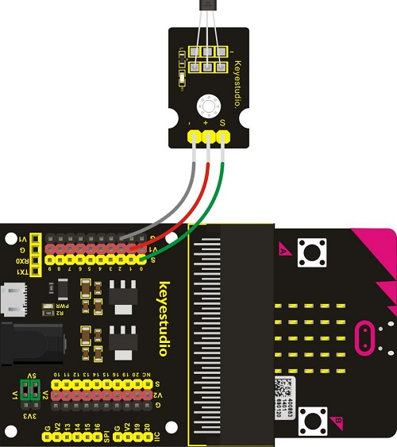**

** Test Code**

** Test Results**

Wire up the components, upload code and plug in power. When the sensor is close
to the magnetic field，the micro：bit will
show，otherwise, the
image will be shown.

### **Project 25: Follow Black Line**

  **Project Introduction:**

When doing DIY experiments, you perhaps see such a smart car that can follow a
black line and not beyond the black area. How can achieve this? Yeah, make use
of line tracking sensors. In this project, we will use a tracking sensor
combined with micro:bit to detect an object or a black line. You can get the
result shown on the LED display of micro:bit.

The tracking sensor is actually an infrared sensor, which can detect a black
line. The component used in the sensor is TCRT5000 infrared tube.

Its working principle is to use the different reflectivity of infrared light to
the color, then convert the strength of the reflected signal into a current
signal.

When sensor detects a black line, the infrared rays are not emitted or the
intensity of emitted ray back are not sufficiently strong, so that the sensor’s
signal terminal outputs a High level. Otherwise, output a Low level.

  **Components Needed:**

-   Micro:bit main board\*1

-   Keyestudio Micro bit Sensor V2 Shield\*1

-   USB Cable\*1

-   keyestudio Hall Magnetic Sensor\*1

-   DuPont jumper wires

  **Connection Diagram**

****

  **Test Code**

    

  **Test Results**

Done wiring and powered up, send the code to micro:bit. When sensor detects no
object or detects a black line, the infrared rays are not emitted or the
intensity of emitted ray back are not sufficiently strong, so that the sensor’s
signal terminal will output a High level, LED on the

micro:bit will show the number 1. Or else show the number.

Note: on the module, you can rotate the potentiometer to make the LED between on
and off state. The sensitivity is the best.

### **Project 26: Obstacle Avoidance**

** Project Introduction:**

When doing DIY experiments, you perhaps see such a smart car that can
automatically avoid an obstacle ahead. How can achieve this? Yeah, make use of
infrared obstacle avoidance sensors. In this project, we will use a obstacle
sensor combined with micro:bit to detect an object ahead and automatically avoid
it. You can get the result shown on the LED display of micro:bit.

** Components Needed:**

-   Micro:bit main board\*1

-   Keyestudio Micro:bit Sensor V2 Shield\*1

-   USB Cable\*1

-   keyestudio Obstacle Detector Sensor\*1

-   DuPont jumper wires

** Connection Diagram**

**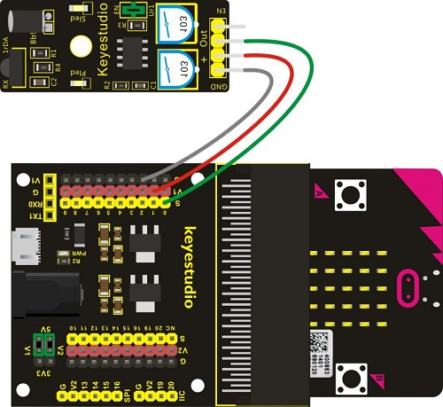**

** Test Code**

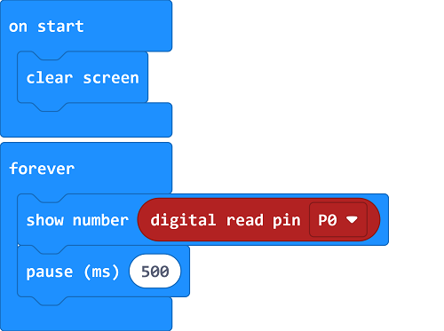

** Test Results**

Wire up the components, upload code and plug in power. When sensor detects an
object ahead, its signal terminal will output a Low level, and LED matrix on the
micro:bit will show the number 0. Or else show the number 1.

**Note:** for obstacle sensor, you can rotate the two potentiometers on the
sensor to adjust its sensitivity. Rotate the potentiometer near the infrared
transmitter tube clockwise to the end, and then adjust the potentiometer near
the infrared receiver. Sled light is turned off and keeps the critical point to
be lit. The sensing distance is the longest.

The effective distance of the sensor is within 2-40 cm.

### **Project 27: Someone Comes**

** Project Introduction:**

You may see such a lens in a film or television. When someone wants to attack a
target, but not close to the target, they were directly found and the alarm
sounded. When some special forces go to the target, they will be covered with
moist mud, so that they will not be discovered by the other party. Why ?

Originally, the human body will emit a certain wavelength of infrared rays of
about 10um. The relevant sensors are installed near the targets that are being
attacked to sense the infrared rays emitted by the human body and then alarm.
After the mud is applied, the sensors can not sense the infrared rays emitted by
the human body.

In this project, you will learn how to use a PIR motion sensor and micro:bit to
detect whether there is someone move nearby. Finally show the different images
on 25 LED matrix of micro:bit.

  **Components Needed:**

-   Micro:bit main board\*1

-   Keyestudio Micro bit Sensor V2 Shield\*1

-   USB Cable\*1

-   keyestudio PIR Motion Sensor\*1

-   Dupont jumper wires

  **Connection Diagram**

****

Note: when you adjust the PIR motion sensor clockwise, the detected range will
increase; on the contrary, the sensed distance will reduce.

  **Test Code**

  **Test Results**

Wire up the components, upload code and plug in power. When the sensor detects
the people moving, the micro:bit will
show; otherwise, the
image will be shown.

### **Project 28: Fire Alarm**

** Project Introduction:**

In daily life, it is often seen that a fire broke out without any precaution. It
will cause great economic and human loss. So how can we avoid this situation?
Right, install a flame sensor and a speaker in those places that easily break
out a fire. When the flame sensor detects a fire, the speaker will alarm people
quickly to put out the fire.

In this project, you will learn how to use a flame sensor and an active buzzer
module to simulate the fire alarm system.

This flame sensor can be used to detect fire or other light sources with
wavelength stands at 760nm \~ 1100nm. Its detection angle is about 60°. You can
rotate the potentiometer on the sensor to control its sensitivity. Adjust the
potentiometer to make the LED at the critical point between on and off state.
The sensitivity is the best.

**Components Needed:**

-   Micro:bit main board\*1

-   Keyestudio Micro bit Sensor V2 Shield\*1

-   USB Cable\*1

-   keyestudio Flame Sensor\*1

-   keyestudio Active Buzzer Module\*1

-   Dupont jumper wires

  **Connection Diagram**

****

**Test Code**

** Test Results**

Wire up the components, upload code and plug in power. When the sensor detects
the flame, the buzzer will chime; otherwise, it won’t emit a sound.

### **Project 29: Crash Sensor**

** Project Introduction:**

During the DIY, we may usually use a machine-3D printer. You can use it to print
any elements with different structures. And limit switch is essential in the
printing, which mainly provides the information whether XYZ axis of printer
reach the boundary point.

Keyestudio crash sensor is a limit switch, available for 3D printer. It is in
essence the same as button module. When printer reaches the top to crash the
spring plate of module, module outputs Low level. If loosen the spring plate,
module outputs High.

In this lesson, you will learn how to use a collision sensor and a digital
buzzer module to simulate the 3D printer limit.

  **Components Needed:**

-   Micro:bit main board\*1

-   Keyestudio Micro bit Sensor V2 Shield\*1

-   USB Cable\*1

-   Keyestudio Crash Sensor\*1

-   Keyestudio Digital Buzzer Module\*1

-   Dupont jumper wires

  **Connection Diagram**

****

  **Test Code**

  **Test Results**

Wire up the components, upload code and plug in power.

When the spring plate of crash sensor is pressed, the buzzer will chime,
otherwise it won’t emit a sound.

### **Project 30: Magnetic Switch**

** Project Introduction:**

In this project, you will learn how to use a keyestudio reed switch module and
micro:bit to detect the magnetic field. Finally show the result on the 25 LED
matrix of micro:bit. Actually in the project 13, we have used a hall magnetic
sensor to detect whether there is magnetic field nearby. So what is the
differences between hall magnetic sensor and reed switch module? You can check
it in component introduction below.

  **Components Needed:**

-   Micro:bit main board\*1

-   Keyestudio Micro bit Sensor V2 Shield\*1

-   USB Cable\*1

-   Keyestudio Reed Switch Module\*1

-   Dupont jumper wires

  **Connection Diagram**

****

  **Test Code**

  **Test Results**

Wire up the components, upload code and plug in power. When the module is close
to the magnetic field, the micro:bit will
display; if not, the
imagewill be shown.

### **Project 31: Relay Module**

** Project Introduction:**

In daily life, we generally use 220V AC to drive the electrical equipment.
Sometimes we will use the switch to control the electrical appliance. If
directly connect the switch to the 220V AC circuit, once electric leakage
happened, people are in danger. Considered with safety, we particularly design
this keyestudio single relay with terminal block of NO (normally open) and NC
(normally closed), which is active at High.

In this project, you will learn how to use our relay module and micro:bit to
control an LED module on and off. (note that for easy wiring, the circuit does
not add 220V voltage, still use 5V.)

** Components Needed:**

-   Micro:bit main board\*1

-   Keyestudio Micro bit Sensor V2 Shield\*1

-   USB Cable\*1

-   Keyestudio Single Relay Module\*1

-   Keyestudio White LED Module

-   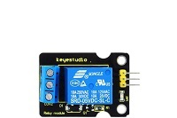Dupont jumper wires

** Connection Diagram**

****

  **Test Code**

  **Test Results**

Wire up the components, upload code and plug in power.

When relay module is connected or disconnected, the LED module will be on and
off, with an interval of 1s.

### **Project 32: Ultrasonic Ranging**

** Project Introduction:**

Ultrasonic sensor is great for all kind of projects that need distance
measurements, avoiding obstacles as examples.

In this project, you will learn how to use a ultrasonic module and micro:bit to
detect the distance between the module and an obstacle ahead.

It includes an ultrasonic transmitter, receiver and control circuit.

Ultrasonic module will emit the ultrasonic waves after trigger signal. When the
ultrasonic waves encounter an object and are reflected back, the module outputs
an echo signal, so it can determine the distance of object from the time
difference between trigger signal and echo signal.

  **Components Needed:**

-   Micro:bit main board\*1

-   Keyestudio Micro bit Sensor V2 Shield\*1

-   USB Cable\*1

-   Keyestudio Ultrasonic Module\*1

-   Dupont jumper wires

  **Connection Diagram**

**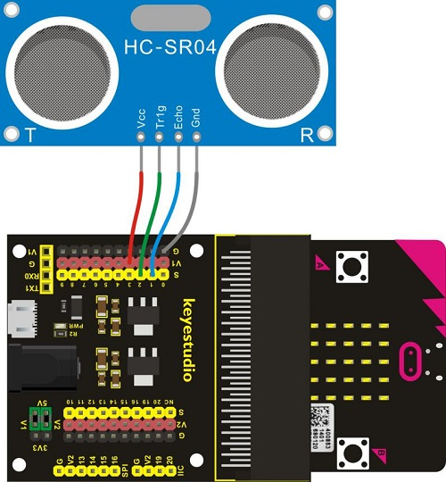**

** Test Code 1**

** Code 2**

Set the code with libraries

Search **sonar**

Check Sonar block in the Makecode editor.

  **Test Results**

Connect micro:bit to computer via USB cable and transfer code to micro:bit. Open
CoolTerm, click Options and select SerialPort, set COM port and baud
rate(115200). Click OK and Connect.

The detected distance value can be shown on the micro:bit and CoolTerm monitor.

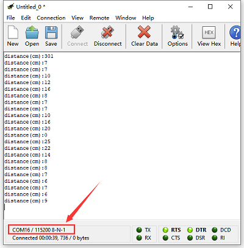

### **Project 33: Light Brightness**

  **Project Introduction:**

It is seen that sensors are everywhere in our daily life. Some public street
lights automatically light up during the day and automatically go out at night.
Why?In fact, those lights make use of a photosensitive element that can measure
the brightness of external light.

In the evening, when outside brightness becomes lower, the street light is
automatically controlled to be turned on. When it is bright during the day, the
street light is automatically turned off.

In this project, you will learn how to use our keyestudio photocell sensor and
micro:bit to control the brightness of external light. Show the result on 5\*5
LED of micro:bit or serial monitor of CoolTerm software.

  **Components Needed:**

-   Micro:bit main board\*1

-   Keyestudio Micro bit Sensor V2 Shield\*1

-   USB Cable\*1

-   keyestudio Photocell Sensor\*1

-   Dupont jumper wires

  **Connection Diagram**

****

  **Test Code**

****

  **Test Results**

Connect micro:bit to computer via USB cable and transfer code to the micro:bit.

Open CoolTerm, click Options and select SerialPort, set COM port and baud
rate(115200). Click OK and Connect.

CoolTerm monitor shows the corresponding analog signal, with the light intensity
getting weaker, the analog value plummets gradually；otherwise, the analog value
will grow and LED will become brighter.

### **Project 34: Hear Footsteps**

** Project Introduction:**

As for those corridor lights, when we walk through the corridor to make a sound,
the corridor light will automatically light up, after that, quiet down, the
lights are off. Why? Actually inside the lighting circuit, it has installed a
sound sensor. When detects the sound, light is turned on, or else LED off.

In this lesson, we connect an analog sound sensor to P0 of micro:bit, then
detect the outside sound via reading the analog value of P0.

The greater the external sound, the greater the analog value.

You can see the analog value is displayed on the micro:bit LED matrix, or check
it from serial monitor of CoolTerm software.

Note: you can rotate the potentiometer to adjust the sound intensity.

  **Components Needed:**

-   Micro:bit main board\*1

-   Keyestudio Micro bit Sensor V2 Shield\*1

-   USB Cable\*1

-   Keyestudio Analog Sound Sensor\*1

-   Dupont jumper wires

  **Connection Diagram**

****

  **Test Code**

****

  **Test Results**

Wire up according to connection diagram. Plug in external power and upload code
to micro:bit. Open CoolTerm, click Options and select SerialPort, set COM port
and baud rate(115200). Click OK and Connect.

You can see the sound value on the micro:bit and monitor.

### **Project 35: Rotary Potentiometer**

  **Project Introduction:**

In this experiment, the signal end of keyestudio Analog Rotation Sensor is
connected to micro:bit P0. By reading the analog value of P0, rotate the
potentiometer, you should see the analog value is changed on the micro:bit LED
matrix.

This analog rotation sensor is based on a potentiometer. It actually uses a
variable resistor. When rotate the potentiometer, it actually changes the
resistance of variable device.

In the experiment, set well the circuit, convert the resistance changes into
voltage changes, then input the voltage changes into Analog Input of micro:bit
via signal end, getting the analog value via programming.

  **Components Needed:**

-   Micro:bit main board\*1

-   Keyestudio Micro bit Sensor V2 Shield\*1

-   USB Cable\*1

-   Keyestudio Analog Rotation Sensor\*1

-   Dupont jumper wires

  **Connection Diagram**

****

  **Test Code**

    ****

  **Test Results**

Connect micro:bit to computer via USB cable and transfer code to micro:bit. Open
CoolTerm, click Options and select SerialPort, set COM port and baud
rate(115200). Click OK and Connect.

When you adjust the potentiometer, you will see the detested data on the
micro:bit and CoolTerm software.

### **Project 36: Alcohol Content in the Air**

** Project Introduction:**

In this project, you will learn how to use an analog Alcohol sensor and
micro:bit to detect the alcohol content in the air.

This analog sensor-MQ3 is suitable for detecting the alcohol. It can be used in
a breath
[analyzer](file:///C:\Documents%2520and%2520Settings\Administrator\桌面\javascript:void(0);).
It has a good selectivity because it has higher sensitivity to alcohol and lower
sensitivity to Benzine.

The sensitivity can be adjusted by rotating a potentiometer on the sensor.

It has two signal pins, Analog A0 and Digital D0. The higher the alcohol
concentration, the higher the A0 value.

When both alcohol concentration and A0 value reach a certain value, D0 changes
from low level to high level, which can be controlled by potentiometer.

  **Components Needed:**

-   Micro:bit main board\*1

-   Keyestudio Micro bit Sensor V2 Shield\*1

-   USB Cable\*1

-   Keyestudio MQ-3 Alcohol Sensor\*1

-   Dupont jumper wires

  **Connection Diagram**

****

  **Test Code**

    **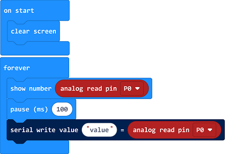**

  **Test Results**

Wire components up, plug in external power and transfer code to the micro:bit.
The higher the concentration of alcohol, the larger the data. The data can be
shown on the micro:bit and monitor.

Open CoolTerm, click Options and select SerialPort, set COM port and baud
rate(115200). Click OK and Connect.

### **Project 37: Flammable Gas in the Air**

  **Project Introduction:**

In real life, gas leakage events often occur. If toxic or flammable and
explosive gas are leaked out, there exist huge potential hazards to people’s
health. So people have developed different kinds of sensors to detect various
gas contents in the air, which can timely alarm to process the leaking gas.

In this project, you will learn how to use an analog gas sensor and micro:bit to
detect the flammable gas in the air. Show the analog value of gas on the LED
matrix of micro:bit or check it on the serial monitor.

  **Components Needed:**

-   Micro:bit main board\*1

-   Keyestudio Micro bit Sensor V2 Shield\*1

-   USB Cable\*1

-   keyestudio MQ-2 Gas Sensor\*1

-   DuPont jumper wires

  **Connection Diagram**

****

  **Test Code**

****

  **Test Results**

Wire components up, plug in power and upload code to micro:bit.

The stronger the combustible gas is, the larger the data displays. You can view
the data on the micro:bit and CoolTerm monitor.

Open CoolTerm, click Options and select SerialPort, set COM port and baud
rate(115200). Click OK and Connect.

### **Project 38: Ambient Temperature Detection**

**Project Introduction:**

In the previous project 23, we only get the analog value of temperature in the
current environment. Now, we are going to use a LM35 linear temperature sensor
to detect the ambient temperature. Finally get the specific temperature value of
current ambient via calculating, and display it on the micro:bit LED matrix or
on the CoolTerm monitor.

**Components Needed:**

-   Micro:bit main board\*1

-   Keyestudio Micro bit Sensor V2 Shield\*1

-   USB Cable\*1

-   keyestudio LM35 Linear Temperature Sensor\*1

-   DuPont jumper wires

**Connection Diagram**

****

**Test Code**

**Test Results**

Wire up components, plug in power and transfer code to the micro:bit. Open
CoolTerm, click Options and select SerialPort, set COM port and baud
rate(115200). Click OK and Connect.

Then the CoolTerm monitor and the micro:bit display the current temperature, as
shown below:

### **Project 39: TEMT6000 Sensor**

**Project Introduction:**

This lesson is a little bit similar to the previous illumination test by a
photocell. But this time we will use keystudio TEMT6000 light sensor whose
sensitivity is better than a photocell.

You will learn how to use a TEMT6000 sensor and micro:bit to test the ambient
light. Show the analog value on the micro:bit LED matrix or on the CoolTerm
monitor.

**Components Needed:**

-   Micro:bit main board\*1

-   Keyestudio Micro bit Sensor V2 Shield\*1

-   USB Cable\*1

-   TEMT6000 Ambient Light Sensor\*1

-   DuPont jumper wire\*3

**Connection Diagram**

****

**Test Code**

****

**Test Results**

Wire up components, plug in power and transfer code to the micro:bit. Open
CoolTerm, click Options and select SerialPort, set COM port and baud
rate(115200). Click OK and Connect.

Then the CoolTerm monitor and the micro:bit display the light intensity value,
as shown below:

### **Project 40: Automatically Watering Device**

**Project Introduction:**

In life, you may often water some flowers and plants from time to time to
prevent them from withering, but not need to pour more. It may requires
experience. So can we make a system that allows the machine to automatically
water the plants’ soil when it is dry? Of course yes.

In this project, you will learn how to use a soil sensor and micro:bit to detect
the humidity of your plants’ soil. Display the analog value on the micro:bit LED
matrix or on the serial monitor. The greater the humidity, the greater the
analog value.

**Components Needed:**

-   Micro:bit Main board\*1

-   Keyestudio Micro bit Sensor V2 Shield\*1

-   USB Cable\*1

-   keyestudio Soil Humidity Sensor\*1

-   DuPont jumper wires

*Connection Diagram**

****

**Test Code**

**Test Results**

Wire up according to connection diagram. Plug in external power and upload code
to micro:bit, open CoolTerm, click Options and select SerialPort, set COM port
and baud rate(115200). Click OK and Connect.

Insert soil humidity sensor into soil. The humidity value varies with the
humidity. The higher the humidity is, the larger the humidity value is.

### **Project 41: Water Level Alarm**

**Project Introduction:**

In real life, when heavy rain occurs, the water level in a river or a reservoir
will rise sharply. When reaching a certain water level, it is necessary to open
a floodgate to solve the safety hazard. However, how to detect the water level
in a river or a reservoir? Very simple, use a water level sensor.

In this experiment, we are about to use a water sensor and a buzzer module to
detect the water level in the glass, if beyond level, buzzer should make an
alarm.

**Components Needed:**

-   Micro:bit main board\*1

-   Keyestudio V2 Shield\*1

-   USB Cable\*1

-   Keyestudio Water level Sensor\*1

-   Keyestudio Digital Buzzer Module\*1

-   DuPont jumper wires

**Connection Diagram**

****

**Test Code**

**Test Results**

Wire components up, plug in external power and transfer code to micro:bit. Open
CoolTerm, click Options and select SerialPort, set COM port and baud
rate(115200). Click OK and Connect.

The micro:bit and CoolTerm software show the analog value. The stronger the UV
radiation, the larger the number is.

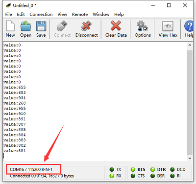

### **Project 42: Ultraviolet Detection**

**Project Introduction:**

In this project, you will learn how to use Ultraviolet sensor and micro:bit to
detect the ultraviolet light. Show the analog value on the micro:bit LED matrix
or on the CoolTerm monitor.

This sensor mainly includes GUVA-S12SD, applied to measure ultraviolet index of
intelligent wearable device, such as watches, smart phone and outdoor device
with UV index.

In the aspect of disinfection by ultraviolet rays, it can be used to monitor the
intensity of ultraviolet light or used as a UV flame detector.

**Components Needed:**

-   Micro:bit main board\*1

-   Keyestudio Micro bit Sensor V2 Shield\*1

-   USB Cable\*1

-   Keyestudio GUVA-S12SD 3528 Ultraviolet Sensor\*1

-   DuPont jumper wires

**Connection Diagram**

****

**Test Code**

****

**Test Results**

Wire up components，plug in external power and upload code to micro:bit，open
CoolTerm, click Options and select SerialPort, set COM port and baud
rate(115200). Click OK and Connect.

The CoolTerm serial monitor shows the analog signal read by ultraviolet sensor.
The greater the Ultraviolet light, the greater the value.

### **Project 43: Vapor in the Air**

**Project Introduction:**

Our lives are surrounded by air everywhere. The air contains many ingredients,
some of which are useful, some are harmful, some of which have a significant
impact on the human body, and some of which have a slight effect on the human
body.

So in this lesson, you will learn how to use a steam sensor and micro:bit to
detect the vapor content in the air. Show the analog value on the micro:bit LED
matrix or on the serial monitor.

**Components Needed:**

-   Micro:bit main board\*1

-   Keyestudio Micro bit Sensor V2 Shield\*1

-   USB Cable\*1

-   keyestudio Steam Sensor\*1

-   DuPont jumper wires

**Connection Diagram**

****

**Test Code**

****

**Test Results**

Wire up components,plug in power and upload code to the micro:bit，Open
CoolTerm, click Options and select SerialPort, set COM port and baud
rate(115200). Click OK and Connect.

The CoolTerm serial monitor shows the analog signal read by steam sensor. The
higher the vapor content is in the air, the greater the value is.

The micro:bit and monitor show the value.

### **Project 44: Pressure Detection**

**Project Introduction:**

In the previous projects, you have learned various external information detected
by different sensors, such as temperature, light, sound, gas, and so on. Now,
let’s use the Keyestudio thin-film pressure sensor and micro:bit to detect
external stress. Show the analog value of pressure on the micro:bit LED matrix
or on the serial monitor.

**Components Needed:**

-   Micro:bit main board\*1

-   Keyestudio Micro bit Sensor V2 Shield\*1

-   USB Cable\*1

-   keyestudio Thin-film Pressure Sensor\*1

-   Dupont jumper wires

**Connection Diagram**

**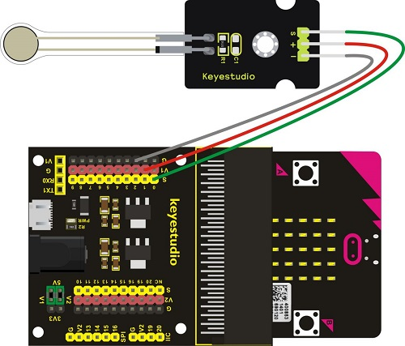**

**Test Code**

**Test Results**

Wire up components, plug in power and upload code to the micro:bit，open
CoolTerm, click Options and select SerialPort, set COM port and baud
rate(115200). Click OK and Connect.

The stronger the pressure is on the thin film, the larger the analog value is,
as shown on CoolTerm monitor:

### **Project 45:Light Controlled by Vibration**

**Project Introduction:**

In this project, you will learn how to use a vibration sensor and micro:bit to
control an LED on and off.

This sensor is mainly based on a 801S sensor element. The interior structure is
a metal ball fixed on a special spring as a pole, and the other surrounded by it
as another pole. Once the vibration reaches a certain amplitude, the two poles
are connected.

**Components Needed:**

-   Micro:bit main board\*1

-   Keyestudio Micro bit Sensor V2 Shield\*1

-   USB Cable

-   Keyestudio Vibration Sensor

-   keyestudio Piranha While LED Module

-   Dupont jumper wires

**Connection Diagram**

****

**Test Code**

    

**Test Results**

Hook up the components, upload code and plug in power.

When the vibration signals are detected by the vibration sensor, the white LED
is on.

### **Project 46: Joystick**

**Project Introduction:**

For some DIY projects, you perhaps use a component, that is, joystick module,
such as game joysticks. How could they operate?

In this lesson, you will learn how to control a joystick module and micro:bit
shield to display the data on serial monitor.

Lots of interactive projects may need joystick. This module provides an
affordable solution, easy to use.

On the joystick module, it has 3 signal interfaces, which can simulate the
three-dimensional space. The signal pins X and Y will simulate the X-and Y-axis
of space. Connect them to Analog Input of microcontroller. By controlling 2
analog input values to control the coordinate of an object in X- or Y-axis.

Another signal pin Z( labeled B on the module) will simulate the Z-axis of
space. Generally connected to Digital port, and used as a button.

**Components Needed:**

-   Micro:bit main board\*1

-   Keyestudio Micro bit Sensor V2 Shield\*1

-   USB Cable\*1

-   keyestudio Joystick Module\*1

-   DuPont jumper wires

**Connection Diagram**

**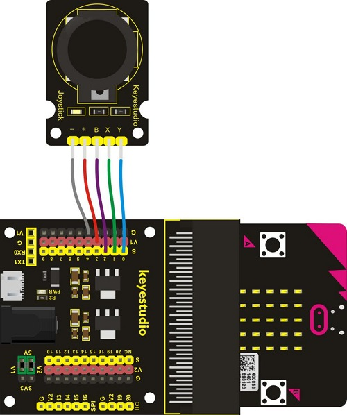**

**Test Code**

**Test Results**

Wire up according to connection diagram. plug in external power and upload code
to micro:bit. Open CoolTerm, click Options and select SerialPort, set COM port
and baud rate(115200). Click OK and Connect.

If you operate the joystick, the analog value on X, Y and B will change, as well
as pin B, as shown below:

### **Project 47: Micro Servo**

**Project Introduction:**

For those DIY smart cars, they often have a function of automatic obstacle
avoidance. In the DIY process, we need a servo to control the ultrasonic module
to rotate left and right, and then to detect the distance between car and
obstacles, so as to control the car to avoid obstacles.

If use other microcontrollers to control the rotation of servo, we need to set a
pulse of a certain frequency and a certain width in order to control the servo
angle.

But if use the micro bit main board to control the servo angle, we only need to
set the control angle in the development environment. The corresponding pulse
will be automatically set in the development environment to control the servo
rotation.

In this project, you will learn how to control the micro servo rotate back and
forth between 0°and 90°.

**Components Needed:**

-   Micro:bit main board\*1

-   Keyestudio Micro bit Sensor V2 Shield\*1

-   USB Cable\*1

-   keyestudio Micro Servo\*1

**Connection Diagram**

****

**Test Code**

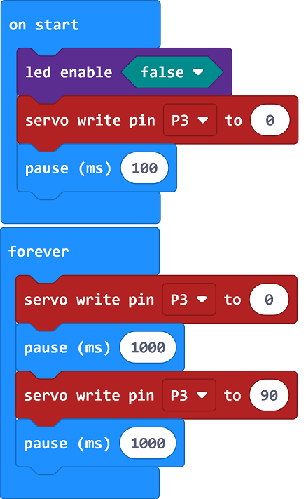

**Test Results**

Done wiring and plug in external power,send the above code to micro:bit. You
should see the servo turn back and forth between 0° and 90°.

### **Project 48: Add An LCD**

**Project Introduction:**

In life, we can use the display and other sensors to do a variety of
experiments. You can DIY a variety of small items. For example, use a
temperature module and display to make a temperature tester, or use an
ultrasound module and display to make a distance tester.

In the following, we will use keyestudio 1602 I2C module as the display, connect
it to I2C pin headers of micro:bit shield. You will learn how to control the
1602 LCD show the character“keyestudio”and number.

**Components Needed:**

-   Micro:bit main board\*1

-   Keyestudio Micro bit Sensor V2 Shield\*1

-   USB Cable\*1

-   keyestudio 1602 I2C Module\*1

-   DuPont jumper wires

**Connection Diagram**

****

**Test Code**

Set code with the library

Copy and search the following extension library lcd1602 in the extension:

[**https://github.com/xuefengedu/pxt-lcd1602_CN**](https://github.com/xuefengedu/pxt-lcd1602_CN)

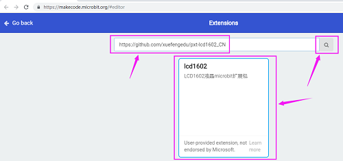

Then you can view it in the listed blocks.

**Test Results**

Note: You can adjust the potentiometer at the back to make the displayed
characters brighter if the screen doesn't show characters.

Wire up the components, upload code and plug in power, then 1602LCD will
show“keyestudio”on the first line, and numbers on the second line.

### **Project 49: Analog Temperature**

** Project Introduction:**

In this project, we are going to detect another important index in the
environment, that is, temperature. You will learn how to use an analog
temperature sensor and micro:bit to display the analog value of current
temperature on the micro:bit LED matrix or on the CoolTerm monitor.

This analog temperature module is based on a thermistor whose resistance varies
with temperature change.

It can detect surrounding temperature changes in real time.

Through the circuit connection, convert the resistance changes into voltage
changes, then input the voltage changes into Analog Input of micro:bit via
signal end. Actually the analog value of micro:bit can be calculated into
temperature value via programming.

This sensor is convenient and effective, widely applied to home alarm system,
gardening, and other devices.

** Components Needed:**

-   Micro:bit main board\*1

-   Keyestudio Micro bit Sensor V2 Shield\*1

-   USB Cable\*1

-   keyestudio Analog Temperature Sensor\*1

-   DuPont jumper wires

  **Connection Diagram**

****

    **Test Code**

  **Test Results**

Hook up components, upload code and plug in power.

You can check the data on the micro:bit and monitor.

## 6. Resources：

<https://fs.keyestudio.com/KS0361-0365>

<https://makecode.microbit.org/>

<https://tech.microbit.org/hardware/>

<https://microbit.org/new-microbit/>

<https://www.microbit.org/get-started/user-guide/overview/>

<https://microbit.org/get-started/user-guide/features-in-depth/>

<https://tech.microbit.org/hardware/edgeconnector/>

<https://microbit.org/guide/hardware/pins/>

[https://microbit.org/guide/quick/](Https://microbit.org/guide/quick/)

<https://microbit.org/get-started/user-guide/mobile/>

<https://microbit.org/code/>

<https://microbit.org/projects/>

